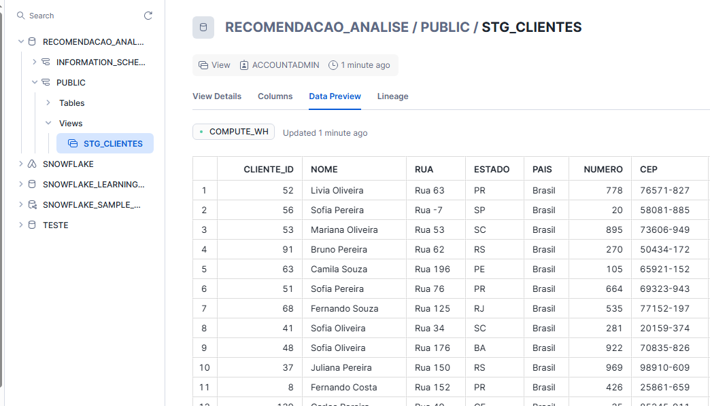
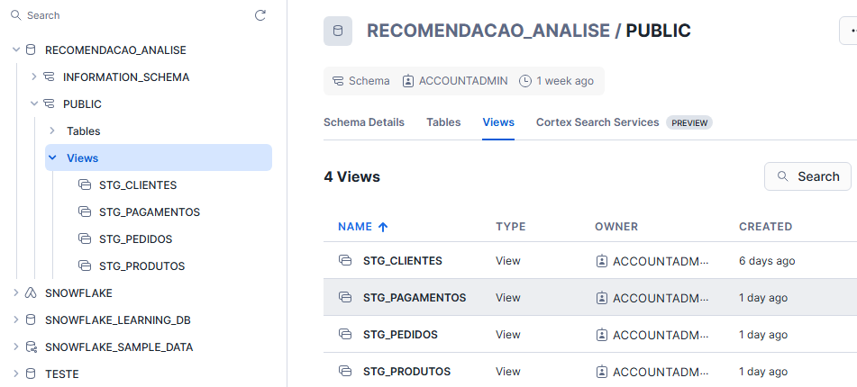
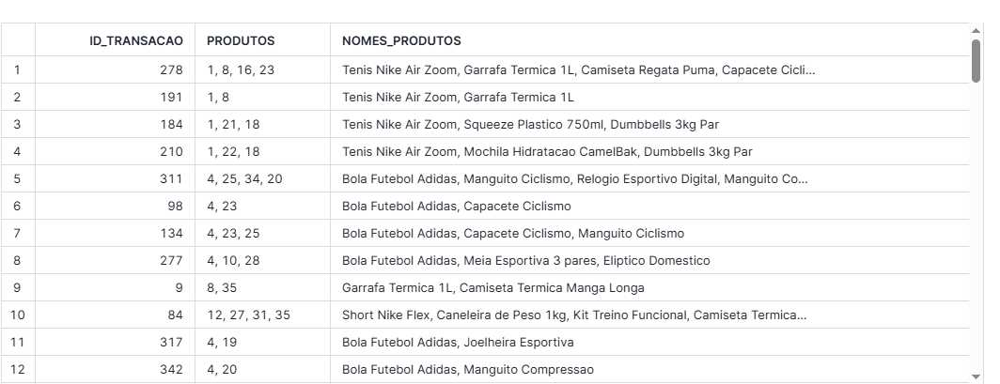

# Recomendação de Produtos com Análise de Cesta de Mercado: Transformação dos Dados com dbt Core

https://www.youtube.com/watch?v=mBrk5hvqc84 20 min

# 1 Introdução
Como mencionado anteriormente, após a ingestão inicial dos dados no Snowflake, as transformações são realizadas com o dbt Core (Data Build Tool), uma ferramenta especializada em transformação de dados baseada em SQL, que permite construir pipelines modulares, auditáveis e versionadas.

No contexto deste projeto, o dbt é responsável por aplicar as transformações necessárias para preparar os dados para análises posteriores, como a aplicação do algoritmo Apriori. Isso inclui tarefas como filtragem, agregação, renomeação e reestruturação dos dados.

Adotamos uma arquitetura de transformação baseada na abordagem ELT (Extract, Load, Transform), na qual os dados são inicialmente extraídos e carregados no Snowflake e posteriormente transformados dentro do próprio data warehouse utilizando o dbt. Essa abordagem permite melhor aproveitamento da escalabilidade do Snowflake e facilita a rastreabilidade e versionamento das transformações.

O fluxo de transformação segue a estrutura em camadas recomendada pela comunidade dbt:

- Staging: limpeza, padronização e renomeação de colunas provenientes dos dados brutos. Exemplos incluem normalização de nomes de produtos, eliminação de nulos e tipagem de colunas.

- Intermediate: estruturação dos dados em um formato analítico intermediário, com joins entre tabelas, pivotagens e agregações por transaction_id.

- Marts: geração das tabelas finais, já otimizadas para o consumo analítico. 

Essa separação em camadas facilita a manutenção, melhora a legibilidade do código SQL e favorece a colaboração entre times 

  Referência: [How we structure our dbt projects](https://docs.getdbt.com/best-practices/how-we-structure/1-guide-overview)

# 2 Configurações necessárias

1-  A primeira parte que precisa ser feita é confirmar se o arquivo profiles.yml foi gerado corretamente. Esse arquivo é gerado automaticamente quando você roda o comando **dbt init**. 
```bash
recomendacao_produtos_dbt:
  outputs:
    dev:
      account: suaconta
      database: seubanco
      password: suasenha
      role: suarole
      schema: seuschema
      threads: especifiqueumvalor
      type: snowflake
      user: seuusuario
      warehouse: COMPUTE_WH
  target: dev
```

Durante a criação do projeto, o dbt solicita as informações de conexão com o banco de dados, como tipo de banco (ex: Snowflake), usuário, senha, warehouse, entre outros.
Essas informações são então salvas no arquivo profiles.yml. O arquivo  para usuários Windows fica localizado em: C:\Users\SeuUsuario\.dbt\profiles.yml. Esse arquivo é essencial porque é ele que permite ao dbt se conectar ao banco de dados e executar os modelos.

2 - O segundo passo é verificar se o arquivo dbt_project.yml foi criado. Esse arquivo é criado automaticamente e parcialmente preenchido quando rodamos o comando dbt init. Ele fica salvo na raiz da pasta do projeto e é nele que você define as principais configurações do seu projeto dbt, como:
- Nome do projeto
- Caminhos das pastas (models, seeds, snapshots, etc.)
- Nome do profile que será usado (que deve bater com o profiles.yml)
- Materialização padrão dos modelos (ex: view, table)
- Estrutura de camadas (staging, intermediate, marts)

Exemplo de dbt_project.yml configurado corretamente:

```bash
name: 'recomendacao_produtos_dbt'     # Nome do projeto
version: '1.0.0'                      # Versão do projeto 

profile: 'recomendacao_produtos_dbt'  # Nome deve ser igual ao usado no profiles.yml


model-paths: ["models"]               # Modelos (transformações em SQL)
analysis-paths: ["analyses"]         
test-paths: ["tests"]                
seed-paths: ["seeds"]               
macro-paths: ["macros"]               


clean-targets:
  - "target"
  - "dbt_packages"


models:
  recomendacao_produtos_dbt:          # Nome da pasta do projeto 
    staging:                          # Subpasta dentro de models
      +materialized: view             # Como será materializado
    intermediate:
      +materialized: view
    marts:
      +materialized: table

```

3 - O terceiro passo é verificar (ou criar) o arquivo packages.yml. Esse arquivo não é criado automaticamente pelo dbt init, mas você pode criá-lo manualmente na raiz do projeto. O packages.yml serve para adicionar extensões ao dbt, como pacotes públicos com macros reutilizáveis, testes prontos e utilitários avançados. Exemplo de packages.yml com o dbt_utils:

```bash
packages:
  - package: dbt-labs/dbt_utils
    version: 1.1.1
```
Depois de criar o packages.yml, execute o comando:

```bash
dbt deps
```
Assim como requirements.txt no Python, o packages.yml define as dependências do seu projeto e deve ser versionado no Git. A pasta dbt_packages/ gerada não precisa ser versionada, pois será recriada com dbt deps.

4 - O quarto passo é organizar corretamente a pasta models/. 
Essa é a principal pasta do seu projeto dbt, onde você coloca os modelos SQL que transformam os dados. Por padrão, o dbt procura os arquivos .sql e schema.yml dentro da pasta models/. Estrutura recomendada:

```bash
models/
├── staging/                  # Camada de entrada 
│   ├── clientes/
│   │   ├── stg_clientes.sql
│   │   └── schema.yml
│   └── ...
├── intermediate/            # Camada com lógica de tratamento
│   ├── clientes/
│   │   ├── int_clientes.sql
│   │   └── schema.yml
├── marts/                   # Camada final, consumo analítico
│   ├── ...
```

 Exemplo stg_clientes.sql, onde colocamos as tranformações que iremos realizar: 

```bash
 {{ config(materialized='view') }}

SELECT
  ID_CLIENTE AS cliente_id,
  NOME_CLIENTE AS nome,
  CEP,
  NUMERO
FROM {{ source('recomendacao', 'TABELA_CLIENTES') }}
```

Exemplo schema.yml para staging, aqui colocamos os testes que faremos:

```bash
version: 2

sources:
  - name: recomendacao
    database: RECOMENDACAO_ANALISE
    schema: PUBLIC
    tables:
      - name: TABELA_CLIENTES

models:
  - name: stg_clientes
    description: "Modelo de staging para clientes"
    columns:
      - name: cliente_id
        description: "ID do cliente"
        tests:
          - not_null
          - unique
```
# 3 - Iniciando o projeto:

 1 - **Para iniciar o projeto, precisamos materializar os primeiros dados.** Depois de criar a estrutura inicial do projeto dbt e os arquivos da camada staging (como o stg_clientes.sql e schema.yml), o próximo passo é executar o modelo para que ele seja materializado no banco de dados, (neste caso, como uma view no Snowflake).  Isso é feito com o comando:
 
 
```bash
dbt run --select stg_clientes
```
 Esse comando executa o modelo e cria a view STG_CLIENTES no Snowflake, refletindo as transformações definidas no SQL.

 2 – **Validar a qualidade dos dados com testes.** Após materializar a view, é importante verificar se os dados estão consistentes com as regras definidas em schema.yml. Para isso, utilizamos o comando:

```bash
dbt test --select stg_clientes
```

Ao executar os testes do modelo stg_clientes, foram identificados os seguintes problemas nos dados brutos:
- IDs de clientes duplicados, o que causou falha no teste de unique.
- Campos cep com valores nulos, falhando no teste de not_null.
- Coluna numero com valores <= 0, que violaram a regra definida no teste expression_is_true

**Decisão de tratamento neste momento:** Como neste estágio do projeto, o objetivo é apenas estruturar a camada de staging e não corrigir completamente os dados, optei por fazer apenas dois ajustes mínimos para garantir que a modelagem continue sem erros críticos:
- Remoção duplicidade de IDs: usando DISTINCT, mantenho apenas um registro por cliente_id
- Substituição de valores negativos na coluna numero: Se for negativo, converto para positivo e se for zero, substituo por NULL.

Essas correções são pontuais e têm o único objetivo de permitir a continuidade da modelagem, o tratamento completo será feito na camada intermediate.

**Importante, o comando dbt run materializa os dados no banco de dados mesmo que os testes definidos no schema.yml tenham falhado. Ou seja, a criação da view ou tabela não depende da aprovação nos testes, os testes servem apenas para alertar sobre problemas nos dados, mas não bloqueiam a execução do modelo.**

3 - Aplicamos as correções diretamente no modelo stg_clientes.sql, realizando a remoção de duplicidades e a substituição de valores negativos na coluna numero. Em seguida, executamos novamente o comando dbt run.

Esse comando recompila o modelo atualizado e substitui a view anterior no Snowflake por uma nova versão, já contendo as correções realizadas. A view STG_CLIENTES passa então a refletir os dados padronizados e validados conforme as novas regras definidas no modelo:



4 - Também materializamos as tabelas PRODUTOS_ESPORTIVOS e TABELA_TIPOS_PAGAMENTO. Como essas tabelas não apresentaram erros, nenhuma correção foi necessária.
Já para a tabela TABELA_CLIENTES, corrigimos inicialmente os seguintes problemas: IDs de transação duplicados para o mesmo produto e campos de ID de cliente nulos.

5 - Agora temos todos os dados necessários materializados no SnowFlake:



6 - Na sequência, o processo foi replicado para as camadas intermediate e marts, com a aplicação de tratamentos customizados conforme as particularidades de cada camada.

# 4 - Resumo dos tratamentos realizados:
No projeto de recomendação de produtos usando dbt, foram implementadas transformações em duas camadas principais: staging e intermediate. Na camada staging, foram criados modelos para padronização e limpeza dos dados brutos.

No modelo stg_clientes, foi feita a renomeação das colunas da tabela original TABELA_CLIENTES e a limpeza da coluna NUMERO, transformando valores nulos ou iguais a zero em NULL e valores negativos em positivos via ABS(). Foram aplicados testes de qualidade como not_null e unique para o cliente_id, not_null em nome e cep, além de uma verificação com expression_is_true garantindo que numero seja maior que zero.

No modelo stg_pedidos, os dados vieram da tabela TABELA_PEDIDOS, e foi aplicado um filtro para garantir que apenas registros com ID_CLIENTE não nulo fossem considerados. Além disso, duplicatas foram removidas por meio de ROW_NUMBER() particionado por ID_TRANSACAO e ID_PRODUTO, mantendo apenas os registros mais recentes e com maior quantidade. Também foram aplicados testes como not_null para colunas-chave e um teste de combinação única (dbt_utils.unique_combination_of_columns) entre id_transacao e id_produto.

No modelo stg_produtos, a tabela PRODUTOS_ESPORTIVOS foi transformada com renomeação de colunas e remoção de duplicatas. Foram aplicados testes como not_null e unique para id_produto e descricao, garantindo integridade e unicidade.

No modelo stg_pagamentos, a tabela TABELA_TIPOS_PAGAMENTO foi padronizada com nomes adequados, e aplicada deduplicação. Foram feitos testes not_null e unique para ambas as colunas: id_pagamento e tipo_pagamento.

Na camada intermediate, os dados passaram por transformações adicionais com foco em regras de negócio e filtragens específicas.

O modelo int_pedidos utilizou a view externa STG_PEDIDOS e aplicou um filtro para considerar apenas pedidos realizados a partir de 1º de janeiro de 2024. Além disso, foram mantidos apenas pedidos cujos id_produto existem na view STG_PRODUTOS. Os testes aplicados incluíram not_null nas colunas principais, relationships para garantir que id_cliente exista em STG_CLIENTES e id_produto em STG_PRODUTOS e também um teste com expression_is_true validando a data mínima do pedido.

O modelo int_clientes utilizou a view externa STG_CLIENTES e aplicou uma regra para manter apenas clientes com idade igual ou superior a 18 anos. Os testes incluíram not_null e unique para ID_CLIENTE, not_null para NOME_CLIENTE e DATA_NASCIMENTO e um teste com expression_is_true para garantir que apenas clientes maiores de 18 anos estejam cadastrados.

As views STG_PRODUTOS e STG_PAGAMENTOS estão limpas, padronizadas e validadas. Como não exigem filtros adicionais ou correções, podem ser utilizadas diretamente nos modelos da camada marts, sem necessidade de uma camada intermediate intermediária.

Com essas transformações, o projeto agora possui uma base confiável e validada para construção dos modelos analíticos finais (marts).

# 5 - Modelagem Final:

Neste modelo final da camada mart foi construída uma view consolidada com o objetivo de apresentar, por transação, os produtos comprados e seus respectivos nomes, de forma agrupada em uma única linha. 

O objetivo principal dessa modelagem é gerar uma tabela compatível com o algoritmo Apriori da biblioteca mlxtend, que requer que cada linha represente uma transação e contenha todos os itens em formato de lista. 

As fontes de dados utilizadas foram:
- int_pedidos: modelo intermediário contendo os pedidos válidos, filtrados por data (igual ou posterior a 2024-01-01), e com integridade referencial com clientes e produtos.
- stg_produtos: modelo de staging com os nomes dos produtos esportivos vendidos.

As principais transformações realizadas foram:
- Realização de um join entre int_pedidos e stg_produtos, associando cada id_produto ao seu respectivo nome_produto.
- Agrupamento por id_transacao, de modo que cada transação apareça apenas uma vez.
- Agregação dos produtos comprados na transação, tanto para os identificadores dos produtos quanto para os nomes dos produtos, resultando em duas colunas separadas:
  - produtos: contém os id_produto separados por vírgula.
  - nomes_produtos: contém os nomes dos produtos separados por vírgula.



Essa estrutura é adequada para ser utilizada em algoritmos de análise de cestas de mercado (market basket analysis), como o Apriori da biblioteca mlxtend, pois organiza os dados de forma transacional com itens agregados por linha. 
A view pode ser consumida diretamente ferramentas de BI.

Autor:  
Leticia da Luz  
[](https://www.linkedin.com/in/leticiadluz/)